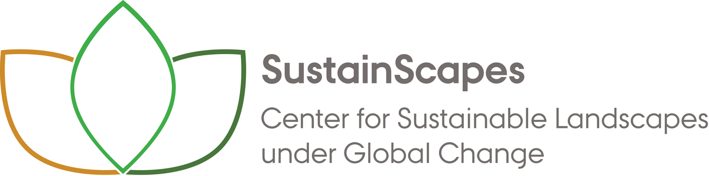

# DK Forest LiDAR v.0.1.0 (beta)
Classifications of Denmark's forest quality using the [EcoDes-DK15 dataset](https://github.com/jakobjassmann/ecodes-dk-lidar) and other spatial data.

**Disclaimer: This project is under development and not yet peer-reviewed.**

### Project overview
- [Workflow Overview](workflow.html)

### Data description
- [Forest annotations and training data](training_annotations.html)
- [Predictor overview](data_overview.html)
- [Focal (window) predictor selection](focal_var_selection.html)

### Model performance
- [Gradient Boosting performance](gbm_models_performance.html)
- [Random Forest performance](ranger_models_performance.html)

### Results
- [Leaflet web app (map of projections)](data_vis.html)
- [Summary stats (area estimates)](summary_stats.html)

### Data / Outputs
- [Summary report - website snapshot (2.2 MB, PDF))](Assmann_et_al-DK_Forest_Quality_Report_v0.1.0.pdf)
- [Gradient Boosting Projections v0.1.0 (23 MB, GeoTiff)](https://dkforestlidar2022.s3.eu-central-1.amazonaws.com/forest_quality_gbm_biowide_cog_epsg3857_v0.1.0.tif)
- [Random Forest Projections v0.1.0 (37 MB, GeoTiff)](https://dkforestlidar2022.s3.eu-central-1.amazonaws.com/forest_quality_ranger_biowide_cog_epsg3857_v0.1.0.tif)
- [Disturbance map v0.1.0 (36 MB, GeoTiff)](https://dkforestlidar2022.s3.eu-central-1.amazonaws.com/disturbance_since_2015_cog_epsg3857_v0.1.0.tif)
- [Training Polygons (44.3 MB, GeoJson)](https://dkforestlidar2022.s3.eu-central-1.amazonaws.com/training_polygons.geojson)

---

[last update: 3 March 2022]
