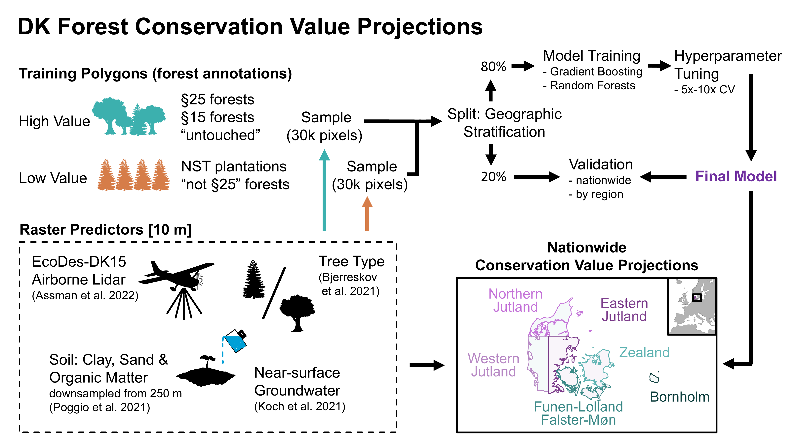

```{r setup, include=FALSE}
knitr::opts_chunk$set(echo = TRUE)
```

This document provides an overview on the workflow that we used to generate
the models for predicting forest quality in Denmark.

In brief: 

1. We gathered raster predictors with 10 m res. that we deemed meaningful for predicting the quality of forests in Denmark.
2. We gathered ~20k annotations for forests with high and low quality in Denmark. 
3. We generated a training dataset of 200k pixels that fell within the annotated forests.
4. We split the training dataset 80%/20% prior model training using a geographic stratification. 
5. We trained Gradient Boosting and Random Forest models.
6. We tuned the model hyperparameters using 10 fold cross validation based on the training dataset from the 80%/20% split. 
7. We tested the final model performance on the validation dataset from the 80%/20% split. 
8. We projected the forest quality across the whole of Denmark using the final models and the predictor rasters. 



